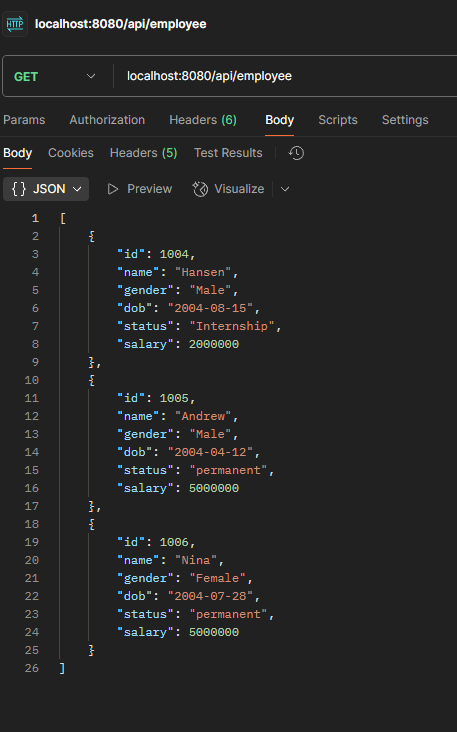
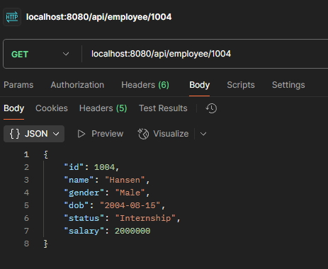
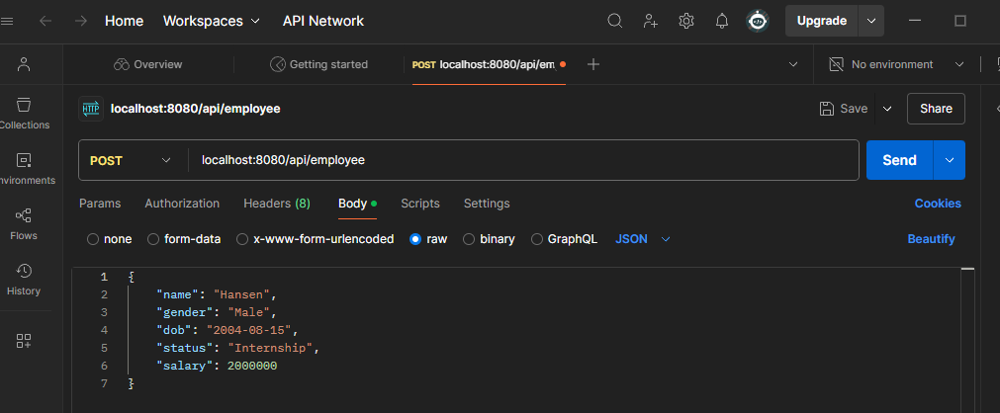
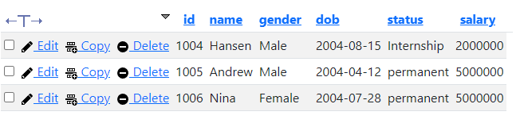
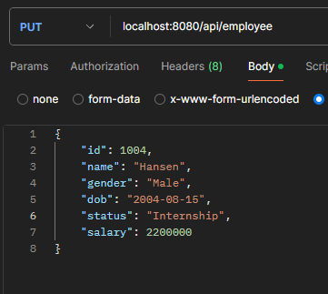
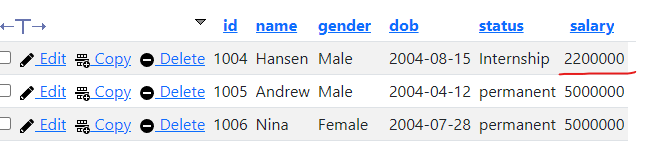
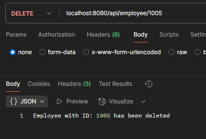
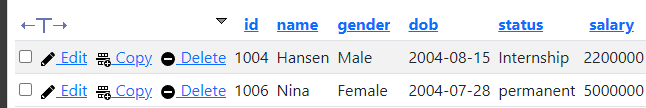

# EndpointAPICRUD
Spring Boot Application that can do simple CRUD into mysql database via Endpoint API

## Run App
1. Create MySQL Database
2. Create MySQL Table using `employee table.sql` or Create Table yourself
3. Edit `src\main\resources\application.properties` to match your SQL Database
4. Build Maven App
5. Run `src\main\java\com.hansen.EndpointAPI\EndpointApiApplication.java`
6. Test the app using postman app or browser.

## Feature
- Get  
-> View all posted data  

- Get by id  
-> View data by passing id  

- Post  
-> Insert new data to database  
> id Using MySQL auto increment, so when inserting new data, no need to specify id  

  

- Edit  
-> Edit data in table using merge function in hibernate  
  

- Delete  
-> Delete data in database using id
> output will show error 500 if no id matching in database   
> delete method using hard delete, so the deleted data can't be recovery   
> soft delete can implemented by adding new column in employee table (like Boolean isDeleted) if true then dont show the data in get and getById Method, and when delete method called just change the isDeleted to true in employee table  

